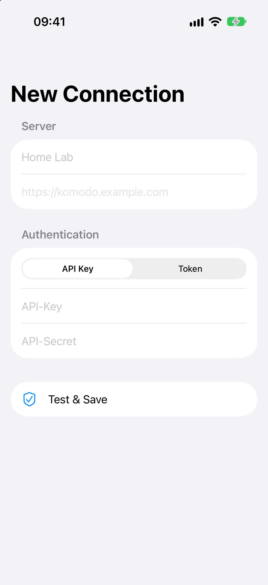
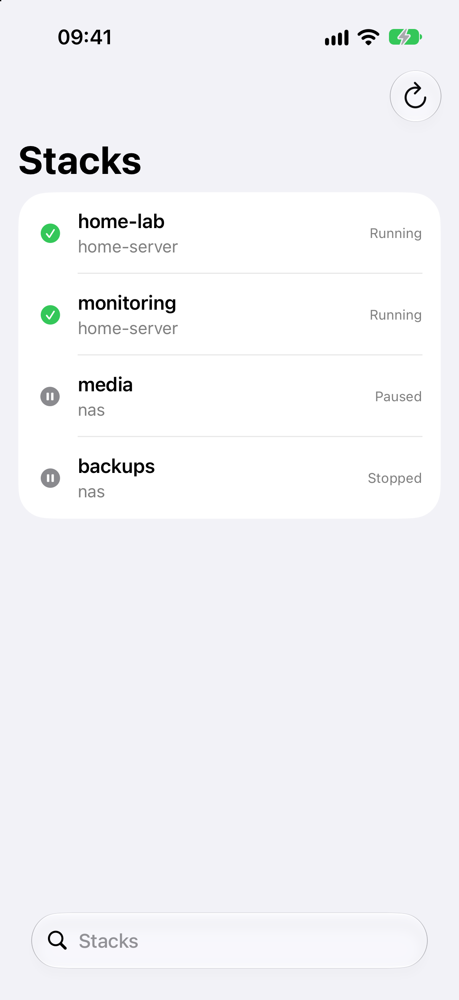
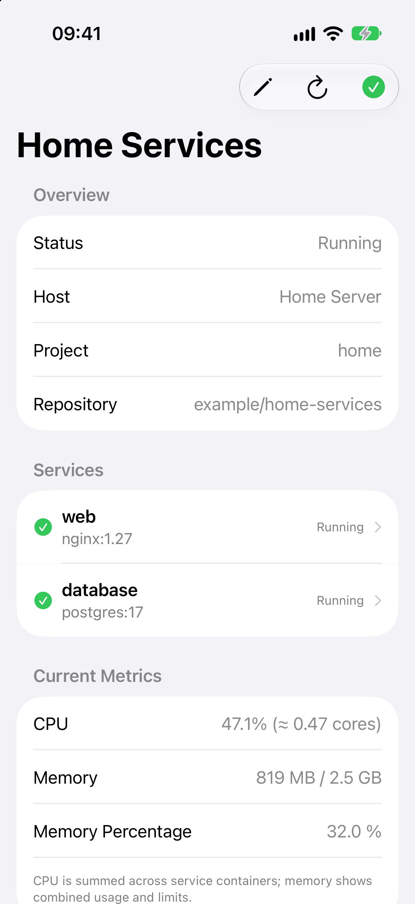

<div align="center">
  
  <h1>Varan</h1>
  <p><strong>A native Komodo companion for iPhone, iPad, and Mac.</strong></p>
  <p>Monitor and control your self-hosted Komodo instances.</p>
</div>

> [!IMPORTANT]
> Varan is currently a development preview. There is no signed public release
> yet; the app must be built from source.

Varan is an independent native client for self-hosted
[Komodo](https://github.com/moghtech/komodo) instances. It is not affiliated
with or endorsed by the Komodo project and does not use upstream trademarks,
brand assets, or source code.

## What Varan does

Varan keeps your Komodo environments within reach across Apple platforms. Add
one or more server profiles, browse and search stacks, inspect services and
container states, stream logs, and start or stop workloads after confirmation.

The shared SwiftUI app adapts its navigation to iPhone, iPad, and Mac while
using the same connection and security model on every platform.

## Highlights

- **Multiple environments:** save server profiles and switch between them with
  adaptive navigation.
- **Stack overview:** search, refresh, and browse paginated stack listings.
- **Service controls:** inspect stack, service, and container states and perform
  confirmed start and stop actions.
- **Live logs:** search and select log output with automatic refresh.
- **Flexible authentication:** connect with a Komodo API key or JWT.
- **Native security:** keep credentials in the system Keychain and non-secret
  profile metadata in SwiftData.
- **Clear connection feedback:** distinguish invalid credentials, offline
  servers, and timeouts.

## Native on iPhone, iPad, and Mac

### iPhone

<p align="center">
  
  
  
</p>

## Connections and security

Credentials are never logged and are stored exclusively in the system
Keychain. SwiftData stores only the profile name, server address,
authentication type, and a non-secret Keychain reference.

External server connections must use HTTPS. Plain HTTP is accepted only for
local addresses, making local development possible without weakening remote
connections. Network requests run through an actor-isolated `URLSession`
client, and Keychain access is isolated separately.

## Requirements

- Xcode 27 or later
- Swift 6
- iOS or iPadOS 18 or later
- macOS 15 or later
- Access to a Komodo instance

## Build from source

Clone the repository and open `Varan.xcodeproj` in Xcode. Unsigned tests and
simulator builds work without an Apple Development team.

For a signed local build, copy
`Configuration/Developer.xcconfig.example` to
`Configuration/Developer.xcconfig`, replace `YOUR_TEAM_ID` with your Apple
Development Team ID, and select an appropriate signing certificate in Xcode.
The local configuration is ignored by Git and applies to the app and test
targets.

Before distributing your own build, replace the placeholder bundle identifier
`de.example.Varan`. Do not commit personal signing settings to the project.

Binary distribution and App Store uploads are intentionally performed locally
through Xcode. This repository does not include GitHub build or release
automation.

## Development and testing

Run the shared test target on macOS:

```bash
xcodebuild \
  -project Varan.xcodeproj \
  -scheme Varan \
  -destination 'platform=macOS,arch=arm64' \
  CODE_SIGNING_ALLOWED=NO \
  test
```

Build the iOS Simulator target without code signing:

```bash
xcodebuild \
  -project Varan.xcodeproj \
  -scheme Varan \
  -destination 'generic/platform=iOS Simulator' \
  CODE_SIGNING_ALLOWED=NO \
  build
```

The test suite covers URL validation, authentication, request construction,
response decoding, error handling, and secure credential storage.

To regenerate the app icon variants with macOS system frameworks, run:

```bash
xcrun swift Scripts/generate-app-icon.swift
```

## Localization

Varan follows the system language. English and German are maintained in
`Varan/Resources/Localizable.xcstrings`, with English as the fallback language.
System permission descriptions live separately in
`Varan/Resources/{en,de}.lproj/InfoPlist.strings`.

Every new user-facing string should be added to the string catalog in both
languages.

## Project status

The core workflow for connecting to Komodo, browsing stacks, controlling
services, and reading logs is implemented and under active development. The
repository is currently intended for development and evaluation rather than
production installation. Interfaces and requirements may change before the
first public release.

## Contributing

Bug reports and focused pull requests are welcome. For substantial changes,
please open an issue before implementation so the scope and product direction
can be agreed first.

Keep contributions compatible with iOS, iPadOS, and macOS, add user-facing
strings in English and German, and run the relevant local XCTest target before
submitting code changes.

## Support

Varan is free and open source. If you find it useful, you can support continued
development on [Ko-fi](https://ko-fi.com/vordenken) or
[Buy Me a Coffee](https://www.buymeacoffee.com/vordenken).

## License

Varan is licensed under the [GNU General Public License v3.0 only](LICENSE).
