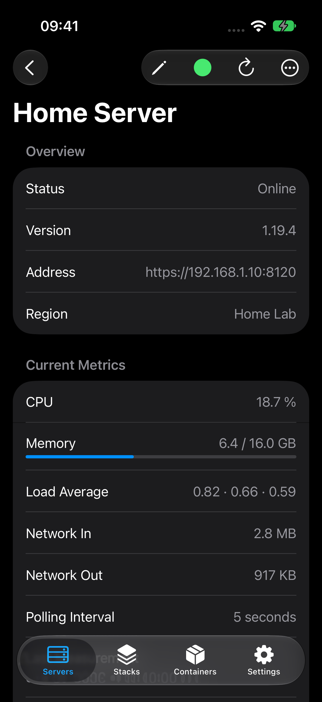
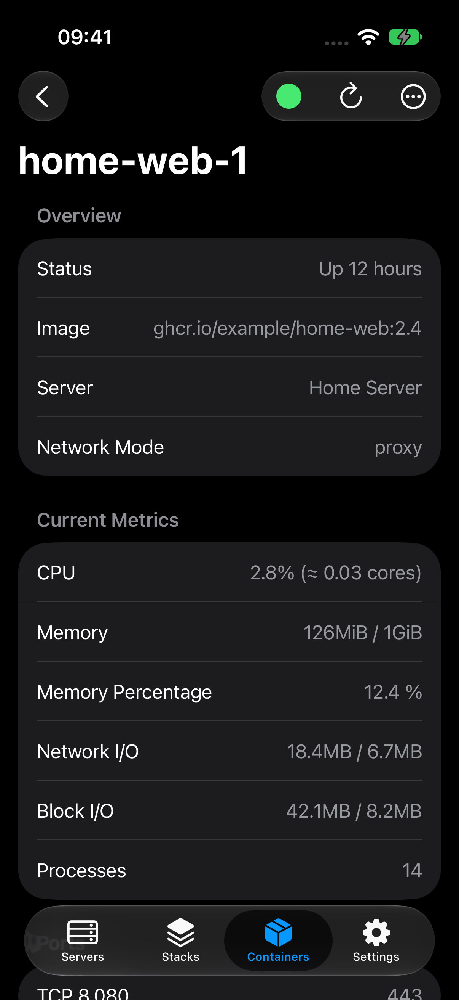

  
  <h1>Varan</h1>
  
<strong>A native Komodo companion for iPhone, iPad, and Mac.</strong>

  
Monitor and manage your self-hosted Komodo environments wherever you are.

> [!IMPORTANT]
> Varan is currently a development preview. There is no signed public release
> yet; the app must be built from source.

Varan is an independent native client for self-hosted
[Komodo](https://github.com/moghtech/komodo) instances. It is not affiliated
with or endorsed by the Komodo project and does not use upstream trademarks,
brand assets, or source code.

## Features

- **Native on Apple platforms:** one SwiftUI app designed for iPhone, iPad, and
  Mac, with navigation and controls that adapt to each platform.
- **Multiple Komodo instances:** add, switch between, and centrally manage
  multiple environments. Read their current state and apply supported
  configuration changes directly from Varan.
- **Servers, stacks, and containers:** browse related resources, inspect their
  state, and move naturally from an environment overview into the details.
- **Live updates:** receive authenticated Komodo events over WebSocket, refresh
  affected views automatically, and reconnect after interruptions.
- **Metrics and history:** monitor current resource usage and explore historical
  server data across multiple time ranges.
- **Logs and workload controls:** search and follow stack or container logs,
  then deploy, update, pause, restart, stop, or remove supported workloads from
  state-aware native menus with clear confirmation.
- **Safe configuration editing:** create and edit supported server and stack
  settings using typed, partial updates while preserving Komodo's API semantics.
- **Secure connections:** authenticate with an API key or JWT. Credentials stay
  in the system Keychain, and remote connections require HTTPS.
- **Guided setup and centralized settings:** connect the first instance through
  onboarding, then manage connections, live updates, polling, and app behavior
  from one settings screen.
- **English and German:** follow the system language across all supported
  platforms.

## Native on iPhone, iPad, and Mac

  
  
  

  <strong>Server details</strong> · <strong>Stack services and metrics</strong> · <strong>Container details</strong>

Captured from the real iOS app in Simulator with deterministic demo data.

The shared app uses a compact tab-based experience on iPhone and iPad and a
native sidebar on Mac. App settings and Komodo instance management remain in a
single predictable place on every platform. Resource details keep connection
state and refresh controls in the toolbar. Stack and container operations live
in a native, state-aware Actions menu, leaving the content and tab bar
unobscured. Stack-wide, service, and container logs open in the same dedicated,
searchable viewer.

## Connection and update behavior

When no connection exists, Varan guides you through adding the first Komodo
instance. Additional instances can be added and managed later in Settings.
Removing the last saved instance returns the app to onboarding.

While a profile is active, Varan listens to Komodo's authenticated update
stream and refreshes resources affected by incoming events. Metrics and logs
use independent foreground refresh intervals because not every change produces
a WebSocket event. Connection state and refresh preferences are visible and
configurable in the app.

Credentials are never logged or stored outside the system Keychain. Varan
stores only non-secret profile information and Keychain references in its local
database. Plain HTTP is accepted only for local addresses; external Komodo
instances must use HTTPS.

## Build from source

See [BUILD.md](BUILD.md) for local setup, signing, build, and test instructions.

## Project status

The core workflow for connecting to Komodo, browsing and managing resources,
receiving live updates, viewing metrics and logs, controlling workloads, and
configuring app-wide behavior is implemented. Varan remains a development
preview intended for evaluation, and interfaces may change before the first
public release.

## Contributing

Bug reports and focused pull requests are welcome. See
[CONTRIBUTING.md](CONTRIBUTING.md) for the branch, versioning, testing, and pull
request workflow.

## Support

Varan is free and open source. If you find it useful, you can support continued
development on [Ko-fi](https://ko-fi.com/vordenken) or
[Buy Me a Coffee](https://www.buymeacoffee.com/vordenken).

## License

Varan is licensed under the [GNU General Public License v3.0 only](LICENSE).
