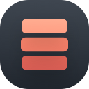
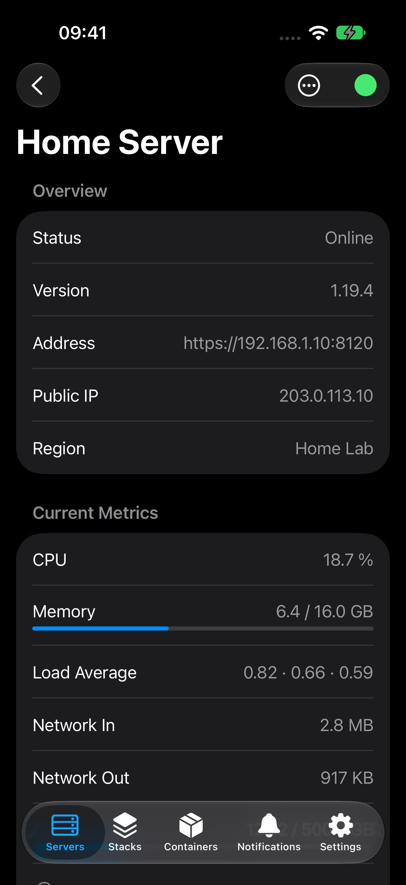
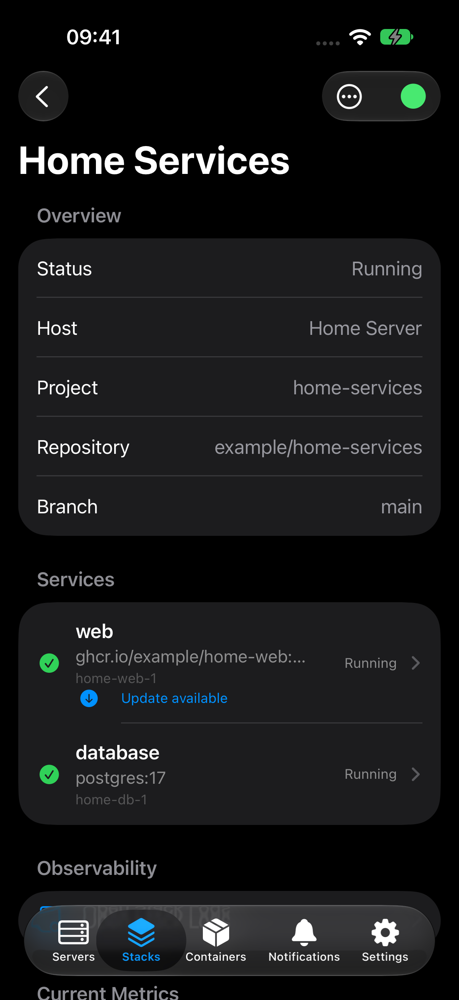
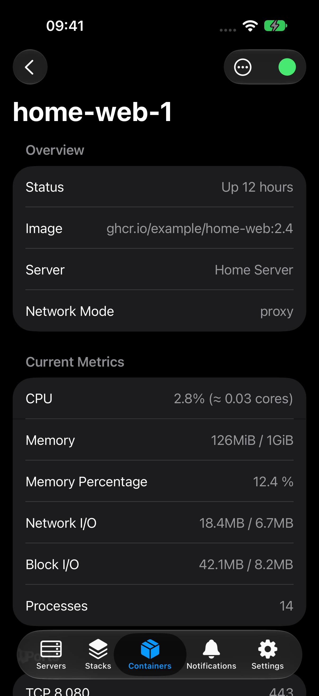
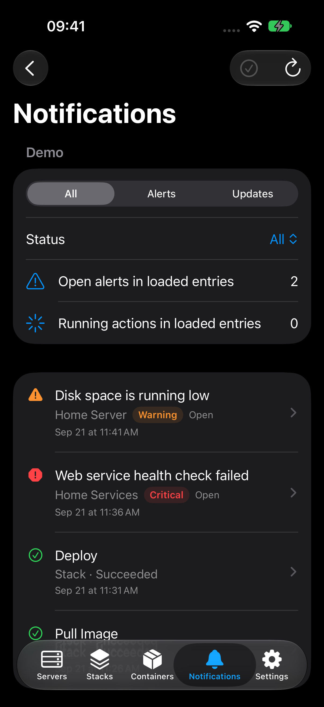

  
  <h1>Varan</h1>
  
<strong>A native Komodo companion for iPhone, iPad, and Mac.</strong>

  
Monitor and manage your self-hosted Komodo environments wherever you are.

> [!IMPORTANT]
> Varan is currently a development preview. There is no signed public release
> yet; the app must be built from source.

Varan is an independent native client for self-hosted
[Komodo](https://github.com/moghtech/komodo) instances. It is not affiliated
with or endorsed by the Komodo project and does not use upstream trademarks,
brand assets, or source code.

## Features

- **Manage resources:** browse servers, stacks, and containers; inspect their
  state; and edit supported server and stack settings with safe partial updates.
- **Operate workloads:** deploy, update, pause, restart, stop, or remove supported
  workloads. Search and follow stack or container logs.
- **Monitor activity:** track current metrics and server history, with live
  updates over Komodo's authenticated event stream.
- **Stay informed:** review alerts and action updates in the notifications
  inbox, filter by status or severity, and jump to supported resources. Optional
  system notifications announce critical alerts and failed actions.
- **Connect securely:** manage multiple Komodo instances from one settings
  screen. Authenticate with an API key or JWT; credentials stay in the system
  Keychain, and remote connections require HTTPS.
- **Use it everywhere:** a native SwiftUI experience adapts to iPhone, iPad, and
  Mac, with guided setup, configurable refresh behavior, and English and German
  localization.

## Native on iPhone, iPad, and Mac

  
  
  
  

  <strong>Server</strong> · <strong>Stack</strong> · <strong>Container</strong> · <strong>Notifications</strong>

Captured from the real iOS app in Simulator with deterministic demo data.

The shared app uses a compact tab-based experience on iPhone and iPad and a
native sidebar on Mac. App settings and Komodo instance management remain in a
single predictable place on every platform. Resource details keep connection
state and refresh controls in the toolbar. Stack and container operations live
in a native, state-aware Actions menu, leaving the content and tab bar
unobscured. Stack-wide, service, and container logs open in the same dedicated,
searchable viewer. The notifications inbox brings Komodo alerts and action
updates together in a separate tab.

## Connection and update behavior

When no connection exists, Varan guides you through adding the first Komodo
instance. Additional instances can be added and managed later in Settings.
Removing the last saved instance returns the app to onboarding.

While a profile is active, Varan listens to Komodo's authenticated update
stream and refreshes resources affected by incoming events. Metrics and logs
use independent foreground refresh intervals because not every change produces
a WebSocket event. Connection state and refresh preferences are visible and
configurable in the app.

Credentials are never logged or stored outside the system Keychain. Varan
stores only non-secret profile information and Keychain references in its local
database. Plain HTTP is accepted only for local addresses; external Komodo
instances must use HTTPS.

## Build from source

See [BUILD.md](BUILD.md) for local setup, signing, build, and test instructions.

## Project status

The core workflow for connecting to Komodo, browsing and managing resources,
receiving live updates, viewing metrics and logs, controlling workloads, and
configuring app-wide behavior is implemented. Varan remains a development
preview intended for evaluation, and interfaces may change before the first
public release.

## Contributing

Bug reports and focused pull requests are welcome. See
[CONTRIBUTING.md](CONTRIBUTING.md) for the branch, versioning, testing, and pull
request workflow.

## Support

Varan is free and open source. If you find it useful, you can support continued
development on [Ko-fi](https://ko-fi.com/vordenken) or
[Buy Me a Coffee](https://www.buymeacoffee.com/vordenken).

## License

Varan is licensed under the [GNU General Public License v3.0 only](LICENSE).
